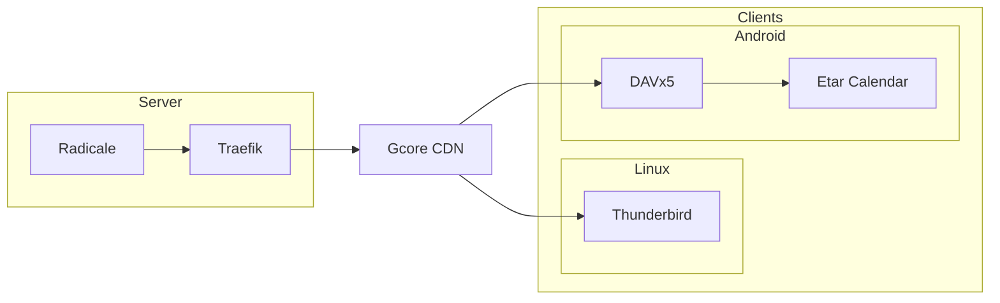

## Background

Due to large number of schedule, it is necessary for me to have a calendar which can help me to schedule my day. In the last year, I used [Outlook Calendar](https://www.microsoft.com/en-us/microsoft-365/outlook/calendar-app) to schedule my time. It is both useful and convenient, but I still choose to self-host a scheduler for privacy reasons.

## My Solution

My solution contains two parts, the server and the client. Both of them should be open-source and non-commercialized applications, which can protect my privacy as much as possible.

For the server side, I choose [Radicale](https://radicale.org/) to be the [CalDAV](https://en.wikipedia.org/wiki/CalDAV) backend, and use [Traefik](https://traefik.io/) for reverse proxy. To hide the IP of my server, I have Radicale running behind [Gcore](https://gcore.com/)'s CDN.

For the client side, I have two platforms, the Linux Desktop and the Android mobile phone. For the previous one, I use [Thunderbird Calendar](https://www.thunderbird.net/) and for the last one, I use [DAVx5](https://www.davx5.com/) + [Etar Calendar](https://github.com/Etar-Group/Etar-Calendar).

So my solution can be displayed as a graph below:



Now, I will introduce how to deploy Radicale and Traefik and how to configure the clients.

## Deploy Traefik

I use docker compose to deploy Traefik. Here is my compose file:

```yaml
version: '3'

services:
  reverse-proxy:
   image: traefik:v3.2
   container_name: traefik
   command:
    - "--api.insecure=false"
    - "--log.level=DEBUG"
    - "--providers.docker=true"
    - "--providers.docker.exposedbydefault=false"
    - "--entrypoints.websecure.address=:443"
    - "--entryPoints.websecure.http.tls.certResolver=myresolver"
    - "--certificatesresolvers.myresolver.acme.tlschallenge=true"
    - "--certificatesresolvers.myresolver.acme.email=your-email@example.com"
    - "--certificatesresolvers.myresolver.acme.storage=/acme.json"
    # - "--certificatesresolvers.myresolver.acme.caserver=https://acme-staging-v02.api.letsencrypt.org/directory"
   ulimits:
      nproc: 65535
      nofile:
        soft: 65535
        hard: 65535
   networks:
     - traefik
   ports:
     - "443:443"
   volumes:
     - /var/run/docker.sock:/var/run/docker.sock
     - ./acme.json:/acme.json
     - ./auth:/auth

networks:
  traefik:
   external: true
```

Replace the `your-email@example.com` with your email.

The `./auth` folder in line 30 stores the user authentication information of Radicale, and I will explain it further in the next section.

Before starting, it needs a network, running the following command to create a network.

```bash
docker network create traefik
```

To store the SSL certificate, it also requires a file named `acme.json`. Just running these commands.

```bash
touch acme.json
chmod 600 acme.json
```

> **Attention**: The `chmod 600 acme.json` is very important!

Now, the directory looks like:

```text
traefik/
├── acme.json
├── auth
│   └── radicale
└── docker-compose.yml
```

> The radicale stores the credential of Radicale authentication.

Now, we can start with the following command.

```bash
docker compose up -d
```

## Deploy Radicale

I prefer to deploy application with docker. So I use [docker-radicale](https://github.com/tomsquest/docker-radicale) to deploy Radicale.

Here is my compose file and I will explain it later.

```yaml
# Can be enhanced with an additional compose file
# See also https://docs.docker.com/compose/production/#modify-your-compose-file-for-production

services:
  radicale:
    image: tomsquest/docker-radicale
    container_name: radicale
    ports:
      - 127.0.0.1:5232:5232
    init: true
    read_only: true
    security_opt:
      - no-new-privileges:true
    cap_drop:
      - ALL
    cap_add:
      - SETUID
      - SETGID
      - CHOWN
      - KILL
    deploy:
      resources:
        limits:
          memory: 256M
          pids: 50
    healthcheck:
      test: curl -f http://127.0.0.1:5232 || exit 1
      interval: 30s
      retries: 3
    restart: unless-stopped
    labels:
      - "traefik.enable=true"
      - "traefik.http.routers.radicale.rule=Host(`radicale.example.com`)"
      - "traefik.http.routers.radicale.entrypoints=websecure"
      - "traefik.http.routers.radicale.tls.certresolver=myresolver"
      - "traefik.docker.network=traefik"
      - "traefik.http.routers.radicale.middlewares=radicale-auth"
      - "traefik.http.middlewares.radicale-auth.basicauth.usersfile=/auth/radicale"
      - "traefik.http.middlewares.radicale-auth.basicauth.headerField=X-Remote-User"
    networks:
      - traefik
    volumes:
      - ./data:/data
      - ./config:/config:ro

networks:
  traefik:
   external: true
```

Replace the `radicale.example.com` with your own domain, and set an A DNS record which points to the IP of your server. Once the ACME challenge is done, there will be some content in the `acme.json`.

For security reasons, it is better to turn on the authentication option. So I add a middle ware between Radicale and Traefik for authentication. Since Radicale uses a configuration file to setting, we need to create a file named `config` and put it under the `config/` folder. So the structure of the directory is:

```text
radicale/
├── config
│   └── config
└── docker-compose.yml
```

There are three types of authentication, `htpasswd`, `remote_user` and `http_x_remote_user`. Because I use Traefik, so I have to use the last one, `http_x_remote_user`. The configuration file is below:

```ini
# -*- mode: conf -*-
# vim:ft=cfg

# Config file for Radicale - A simple calendar server
#
# Place it into /etc/radicale/config (global)
# or ~/.config/radicale/config (user)
#
# The current values are the default ones


[server]

# CalDAV server hostnames separated by a comma
# IPv4 syntax: address:port
# IPv6 syntax: [address]:port
# Hostname syntax (using "getaddrinfo" to resolve to IPv4/IPv6 adress(es)): hostname:port
# For example: 0.0.0.0:9999, [::]:9999, localhost:9999
#hosts = localhost:5232
hosts = 0.0.0.0:5232

# Max parallel connections
#max_connections = 8

# Max size of request body (bytes)
#max_content_length = 100000000

# Socket timeout (seconds)
#timeout = 30

# SSL flag, enable HTTPS protocol
#ssl = False

# SSL certificate path
#certificate = /etc/ssl/radicale.cert.pem

# SSL private key
#key = /etc/ssl/radicale.key.pem

# CA certificate for validating clients. This can be used to secure
# TCP traffic between Radicale and a reverse proxy
#certificate_authority =


[encoding]

# Encoding for responding requests
#request = utf-8

# Encoding for storing local collections
#stock = utf-8


[auth]

# Authentication method
# Value: none | htpasswd | remote_user | http_x_remote_user
type = http_x_remote_user

# Htpasswd filename
# htpasswd_filename =

# Htpasswd encryption method
# Value: plain | bcrypt | md5 | sha256 | sha512 | autodetect
# bcrypt requires the installation of 'bcrypt' module.
# htpasswd_encryption =

# Incorrect authentication delay (seconds)
#delay = 1

# Message displayed in the client when a password is needed
#realm = Radicale - Password Required

# Сonvert username to lowercase, must be true for case-insensitive auth providers
#lc_username = False


[rights]

# Rights backend
# Value: none | authenticated | owner_only | owner_write | from_file
# type = owner_only

# File for rights management from_file
#file = /etc/radicale/rights

# Permit delete of a collection (global)
#permit_delete_collection = True


[storage]

# Storage backend
# Value: multifilesystem | multifilesystem_nolock
#type = multifilesystem

# Folder for storing local collections, created if not present
#filesystem_folder = /var/lib/radicale/collections
filesystem_folder = /data/collections

# Delete sync token that are older (seconds)
#max_sync_token_age = 2592000

# Command that is run after changes to storage
# Example: ([ -d .git ] || git init) && git add -A && (git diff --cached --quiet || git commit -m "Changes by \"%(user)s\"")
#hook =


[web]

# Web interface backend
# Value: none | internal
type = internal


[logging]

level = debug
# Threshold for the logger
# Value: debug | info | warning | error | critical
#level = info

# Don't include passwords in logs
#mask_passwords = True


[headers]

# Additional HTTP headers
#Access-Control-Allow-Origin = *

[hook]

# Hook types
# Value: none | rabbitmq
#type = none
#rabbitmq_endpoint =
#rabbitmq_topic =
#rabbitmq_queue_type = classic
```

Then it comes to the last step, generating the credential. I use `SHA-512` encryption method. The first step is to install `htpasswd`, running this command:

```bash
apt install apache2-utils
```

Then, go to the `traefik/auth` directory, and run this command:

```bash
htpasswd -s -c ./radicale username password
```

Replace the `username` and the `password` with your own username and password. After that, the credential can be generated. If you want to add more users, please remove the `-c` flag, which means creating a new file that will overwrite the original file.

Now, just run `docker compose up -d` to start the docker container. Try to access the website. If everything goes well, after inputting the username and the password, it will redirect to the `https://radicale.example.com/.web/` and display a user interface. After logging in, you can create calendars.

## Configure Clients

### Desktop

It is easy to configure Thunderbird Calendar. Firstly, open Thunderbird and go to the calendar tab. Then, click on `New Calendar` and select `On the Network`. Finally, input the username and the domain and click `Find Calendars`.

### Android

The process is similar to configuring Thunderbird Calendar. Just click the `+` sign, and input the URL and username.

However, DAVx5 is only a tool for synchronization, which means it does not provide the user interface, and we can treat it as a backend.

For the frontend, I choose Etar Calendar. It is also easy to configure Etar Calendar, just launch the application and go to the setting page. Then, click `Add CalDAV Calendar` button, and it will jump to DAVx5, where you can select calendars in Radicale. Finally, it can show the events in the calendars.

---

> References <br/>
> [ChatGPT](https://chatgpt.com/) <br/>
> [Radicale Document](https://radicale.org/v3.html) <br/>
> [Fireyeah](https://blog.0pt.icu/posts/server/traefik-simple-guide/) <br/>
> [Traefik Document](https://doc.traefik.io/traefik/) <br/>
> [docker-radicale](https://github.com/tomsquest/docker-radicale) <br/>
> [Radicale Discussions](https://github.com/Kozea/Radicale/discussions/1368) <br/>
