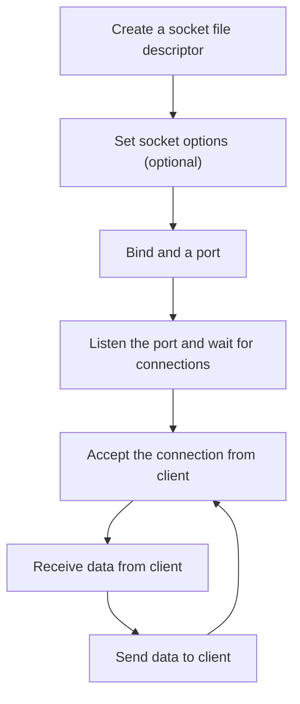

## Background

The "Build your own HTTP server" challenge on [CodeCrafters](https://app.codecrafters.io/catalog) is free in this month, so I took this challenge and learned the usage of `socket`. This note was born for documenting my understanding of `socket` library.

In this note, I will use `C++` to demonstrate the code although `socket` is a library in `C` programming language.

## What is `socket`?

`socket` is used to implement `TCP` or `UDP` connections. It can also be used to implement an `HTTP` connection, since `HTTP` is based on `TCP`. In addition, the developers can treat a socket as a file descriptor or a `FILE` pointer in `C` programming language, using it to read from and write to network connection like regular files.

## Server-Side `socket` Operation

The working process of server-side `socket` is demonstrated in the following flowchart.



## Header Files

After knowing the working process, it is time to explore which header files can be used. In this part, I will introduce the header files and their functions, structures and so on separately.

### `<arpa/inet.h>` & `<netinet/in.h>`

The structure `sockaddr_in` stores the connection information. Its definition is below and I only show the staple members.

```c
typedef uint16_t in_port_t;
struct sockaddr_in
{
    sa_family_t sin_family;
    in_port_t sin_port;
    struct in_addr sin_addr;
};
```

The `in_addr` is defined as:

```c
typedef uint32_t in_addr_t;
struct in_addr
{
    in_addr_t s_addr;
};
```

> *in* stands for *internet*

To assign a value to `sockaddr_in.sin_port`, we can use `uint16_t htons(uint16_t hostshort)` to convert an integer into the `uint16_t` instead of assigning the value directly. One way to use is like:

```cpp
sockaddr_in server_address;
server_address.sin_port = htons(4221);
```

If we want the socket listen to a specific IP, we can use `int inet_pton(int af, const char * cp, void * buf)` to assign the IP address to the `sockaddr_in.sin_addr`. One way to use is:

```cpp
inet_pton(AF_INET, "127.0.0.1", &server_address.sin_addr);
```

Plus, the server should listen to all address `0.0.0.0` sometimes, and we can assign the macro `INADDR_ANY` to `sockaddr_in.sin_addr.s_addr` so the server could listen to any address.

### `<sys/socket.h>`

This header file offers the following useful functions:

* `int socket(int domain, int type, int protocol)`
* `int setsockopt(int fd, int level, int optname, const void * optval, socklen_t optlen)`
* `int bind(int fd, const sockaddr * addr, socklen_t len)`
* `int listen(int fd, int n)`
* `int accept(int fd, sockaddr * addr, socklen_t * addr_len)`
* `ssize_t recv(int fd, void * buf, size_t n, int flags)`
* `ssize_t send(int fd, const void * buf, size_t n, int flags)`

The `sockaddr` is a structure in `<bits/socket.h>` header file, and also the short name of *socket address*. The definition is

```c
struct sockaddr
{
    sa_family_t sa_family;
    char sa_data[14];
};
```

The *sa* prefix stands for *sockaddr*.

Now let's take a look at each functions above.

#### `int socket(int domain, int type, int protocol)`

This function accepts three arguments, which are

| Argument   | Meaning                    | Possible Value                                           |
| ---------- | -------------------------- | -------------------------------------------------------- |
| `domain`   | The address family         | `AF_INET`, `AF_INET6`                                    |
| `type`     | The type of sockets        | `SOCK_STREAM`, `SOCK_RAW`                                |
| `protocol` | The protocol of the socket | `0` (Automatically select), `IPPROTO_TCP`, `IPPROTO_UDP` |

> The *AF* stands for *Address Family`.

And it will return a descriptor of the socket.

The code below is a common way to create a `TCP` socket server.

```cpp
int server_fd = socket(AF_INET, SOCK_STREAM, 0);
```

Where *fd* stands for *file descriptor*.

After creating a file descriptor of the server, it is optional to do some settings, which needs to call `setsockopt()` function.

####  `int setsockopt(int fd, int level, int optname, const void * optval, socklen_t optlen)`

The first argument `fd` is the file descriptor, which is `server_fd` in this example.

The `level` defines the level of protocol. Usually we use `SOL_SOCKET` macro which is defined in `socket.h` header file. There are also some other options like `IPPROTO_TCP`, `IPPROTO_IP` and so on.

The third argument `optname` accepts the options. There are a lot of available options in `socket.h` file, for example, `SO_DEBUG`, `SO_REUSEADDR`, etc.

The remaining value is used to set whether enable or disable the options. If we want to enable the `SO_REUSEADDR` options, the code is

```cpp
int reuse = 1;
setsockopt(server_fd, SOL_SOCKET, SO_REUSEADDR, &reuse, sizeof(reuse));
```

If the function failed, it will return `-1`. Otherwise, it will return `0`.

After setting the socket, we can bind the socket to specific address by using `bind()` function.

####  `int bind(int fd, const sockaddr * addr, socklen_t len)`

The first argument determines which server file descriptor to bind.

The second argument stands for the address we want to bind and the type of it is `const sockaddr *`, however, what we define previous is `sockaddr_in server_address`. So it needs a type cast here.

The last argument is the length of the address, which can gain by just using `sizeof(server_address)`.

The common usage is

```cpp
bind(server_fd, reinterpret_cast<sockaddr *>(&server_address), sizeof(server_address));
```

If the `bind()` failed, it will return `-1`. Otherwise, it will return `0` instead.

By the flowchart above, the next stage is to listen to the client connections, which needs `listen()` function.

####  `int listen(int fd, int n)`

This function is easier than previous functions since it has only two arguments.

The first one is the file descriptor of the server.

The second one determines the maximum connections can be queued.

If we want the server to listen to the address with maximum 5 connections queuing, the statement is

```cpp
listen(server_fd, 5);
```

Same as the functions before, it will return `-1` if it failed and return `0` if it succeeded.

####  `int accept(int fd, sockaddr * addr, socklen_t * addr_len)`

This function is used to get the client's address and the file descriptor of the client.

The first argument is the file descriptor of the server.

The second argument is the address of client.

And the third argument is the length of client address.

It will return a non-negative integer to stand for the file descriptor of the client. It will return negative integer once it failed.

One simple way to use it is

```cpp
sockaddr_in client_address;
size_t      client_address_length = sizeof(client_address);
int         client_fd =
    accept(server_fd, reinterpret_cast<sockaddr *>(&client_address),
            reinterpret_cast<socklen_t *>(&client_address_length));
```

After gaining the file descriptor of client, it means we can treat it as regular files. In this example, we only show how to receive and send data.

####  `ssize_t recv(int fd, void * buf, size_t n, int flags)`

This function is used to receive data from `fd`. If we want to receive the data from the client, we can set it to `client_fd` which has gotten before.

The second argument accepts a buffer to store the received data. Usually we use a string to store the data.

The third argument is the size or the length of the buffer.

The last argument `flags` is used to control the behavior of receiving. By default, we can set it to `0`. There are also some other options which is defined in `<bits/socket.h>` in macro form.

If the function failed, it will return `-1`. And if it succeeded, it will return the size of received data.

One example is

```cpp
const size_t BUFFER_SIZE = 1024;
std::string buffer(BUFFER_SIZE, '\0');

ssize_t receive_bytes = recv(client_fd, &buffer[0], BUFFER_SIZE, 0);
buffer.resize(receive_bytes);
```

####  `ssize_t send(int fd, const void * buf, size_t n, int flags)`

This function is used to send data to the `fd`. If we want to send data to the client, we can set it to `client_fd`.

The second argument is the buffer which stores the data to be sent.

The third one is the size or length of the buffer.

Same to the `recv()` function, the last argument `flags` controls the behavior of sending data.

The return value is the size of data that is sent successfully. If it failed, the return value will be `-1`.

One example is

```cpp
static const std::string response = "The server accepted the request\n";
send(client_fd, response.c_str(), response.size(), 0);
```

If the connection is closed, and the file descriptor is no longer used, we should use `close()` function which is defined in `<unistd.h>` header file, to close it.

The usage is

```cpp
close(client_fd);
```

---

> Reference
>
> [CodeCrafters](https://app.codecrafters.io/)
