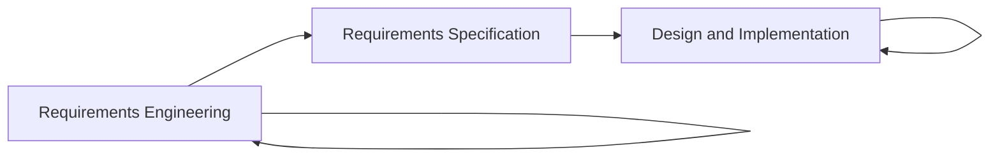
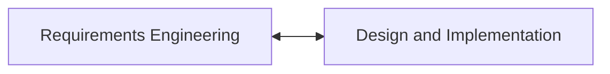

## Chapter 1

### Types of Software Products

* Generic Products
* Customized Products

### Software Process Activities

* Software Specification
* Software Development
* Software Validation
* Software Evolution

### General Issues that Affect Software

* Heterogeneity
* Business and Social Change
* Security and Trust
* Scale

### Evolution Processes

1. Change Identification Process
2. Change Proposals
3. Software Evolution Process
4. New System

## Chapter 2

### Types of Software Processes

* Plan-driven Process
* Agile Process

### Development Models

#### Waterfall Model

##### Process

1. Requirements Analysis and Definition
2. System and Software Design
3. Implementation and Unit Testing
4. Integration and System Testing
5. Operation and Maintenance

##### Problems

* Difficult to make change.
* Inflexible partition of the project.
* Usually used for large systems.

#### Incremental Model

##### Process

1. Outline Description
2. Specification, Development and Validation.

##### Benefits

* The cost of accommodating changing customer requirements is reduced.
* Easy to get customer feedback.
* More rapid delivery and development.

##### Problems

* Invisible Process
* System structure will degrade as new increments are added.

#### Prototyping

##### Process

1. Prototyping Plan
2. Outline Definition
3. Executable Prototype
4. Evaluation Report

##### Benefits

* Improved system usability.
* A closer match to users' real needs.
* Improved design quality.
* Improved maintainability.
* Reduced development effort.

##### Problems

* The prototype may not be used in the same way as he final system.
* The tester of the prototype may not be typical system users.
* Extra training time.

#### Spiral Model

##### Phases

* Planning
* Risk Analysis
* Engineering

#### Rational Unified Process

##### Workflow

* Business Modelling
* Requirements
* Analysis and Design
* Implementation
* Testing
* Deployment
* Configuration and Change Management
* Project Management
* Environment

### Plan-driven VS Agile Development

#### Process of Change Requirements of Plan-driven

#### Process of Change Requirements of Agile Development

### Principles of Agile Methods

* Customer Involvement
* Incremental Delivery
* People not Process
* Embrace Change
* Maintain Simplicity

### Extreme Programming (XP)

* XP Planning
* XP Design
* XP Coding
* XP Testing

#### SCRUM Process Flow

* Holding short meetings.
* Deliver `demos` to customers and gain feedback.
