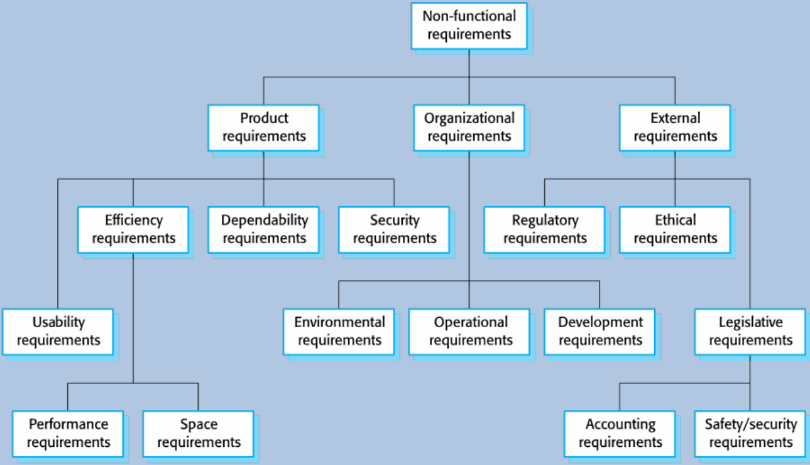

## Definitions

* **Functional Requirement:** These are statements of services the system should provide, how the system should react to particular inputs and how the system should behave in particular situations.
* **Non-functional Requirement:** These are constraints on the services or functions offered by the system.

## Implementation of Non-functional Requirements

Non-functional requirements may affect the overall architecture of a system rather than individual component.

## Classification of Non-functional Requirements

* Product Requirements
  * Requirements which specify that the delivered product must behave in a particular way. (e.g. execution speed, reliability)
* Organizational Requirements
  * Requirements which are a consequence of organizational policies and procedures. (e.g. process standards used, implementation requirements)
* External Requirements
  * Requirements which arise from factors which are external to the system and its development process. (e.g. interoperability requirements, legislative requirements)

