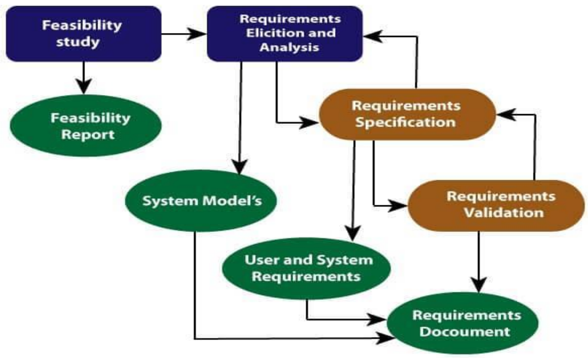
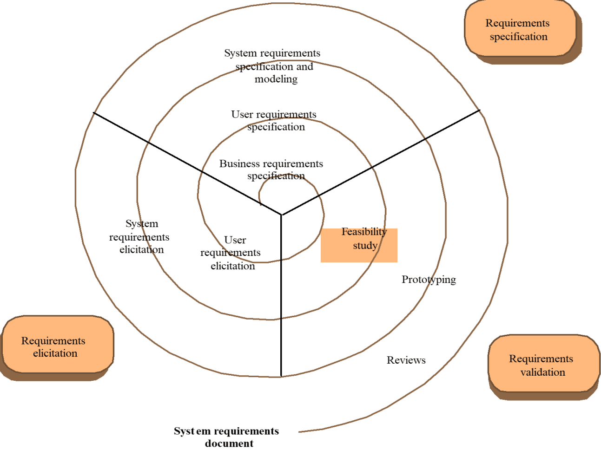
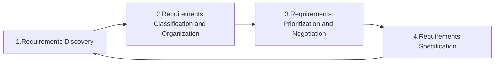

* The processes used for requirements engineering vary widely depending on the application domain, the people involved and the organization developing the requirements.
* The goal of this stage of the software engineering process is to help create and maintain a system/software requirements document.

## Processes

1. Requirements Elicitation
  * What services do the end-users require of the system?
2. Requirements Analysis
  * How do we classify, priorities and negotiate requirements?
3. Requirements Validation
  * Does the proposed system do what the user require?
4. Requirements Management
  * How do we manage the (sometimes inevitable) changes to the requirements document?

## Four High-Level Activities

* Feasibility Study
* Elicitation and Analysis
* Specification
* Validation

### Feasibility Study

* A short, focused study that should take place early in the requirement engineering process. It should answer three key questions:
  * does the system contribute to the overall objectives of the organization?
  * can the system be implemented within schedule and budget using current technology?
  * can the system be integrated with other systems that are used?

### Elicitation and Analysis

* Software engineers work with customers and system end-users to find out about the application domain, what services the system should provide, the required performance of the system, hardware constraints, and so on.
* Stakeholders (end-users, managers, engineers) also may involve in maintenance, domain experts, trade unions, etc.

### Specification

* **Requirement Discovery:** Interact with stakeholders of the system to discover their requirements.
* **Requirements Classification and Organization:** Take the unstructured collection of requirements, groups related requirements, and organizes them into coherent clusters.
* **Requirements Prioritization and Negotiation:** This activity is concerned with prioritizing requirements and finding and resolving requirements conflicts through negotiation.
* **Requirements Specification:** The requirements are documented and input into the next round of the spiral.

### Requirements Validation

* Requirements validation is the process of checking a software system meets specification, what the customer needs.

#### Types of Validation

* **Validity Checks:** A user may think that a system is needed to perform certain functions.
* **Consistency Checks:** Requirements in the document should not conflict.
* **Completeness Checks:** The requirements document should include requirements that define all functions and the constraints intended by the system user.
* **Realism Checks:** Using knowledge of existing technology, the requirements should be checked to ensure that they can actually be implemented.
* **Verifiability:** To reduce the potent, system requirements should always be written so that they are verifiable.

#### Requirements Validation Techniques

* **Requirements Reviews:** Analyze the requirements systematically, checking for errors and inconsistencies.
* **Prototyping:** An executable model of the system in question is demonstrated to end-users and customers.
* **Test-case Generation:** Requirements should be testable.
