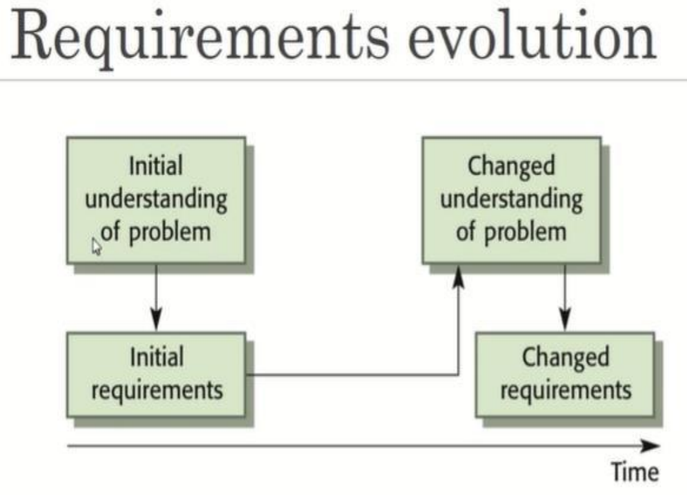
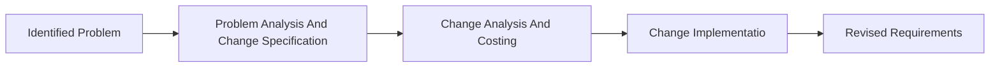

## Definition

* Requirement management is the process of understanding and controlling changes to system requirements.
* Planning is an essential first stage in the requirement management process.
* Planning stage establishes the level of requirements managements detail that is required.

## Changing Requirements

* Process of managing changing requirements during the requirements engineering process and system development.
  * Emerging new requirements.
  * Keep track of individual requirements.
  * Maintain links between dependent requirements to assess the impact of requirements changes.
  * A formal process needed for making change proposals and linking these to system requirements.
* The business and technical environment of the system always changes after installation.
* The users of the system are rarely the same people.
* Large systems usually have diverse users with different requirements.

## Requirement Change Management

* During this stage, the problem or the change proposal is analyzed to check that it is valid. This analysis is fed back to the change requestor who may respond with a more specific requirements change proposal, or decide to withdraw the request.
* The effect of the proposed change is assessed using traceability information and general knowledge of the system requirements. Once this analysis is completed, a decision is made whether to proceed with the requirements change.
* The requirements document and, where necessary, the system design and implementation, are modified. Ideally, the document should be organized so that changes can be easily implemented.
