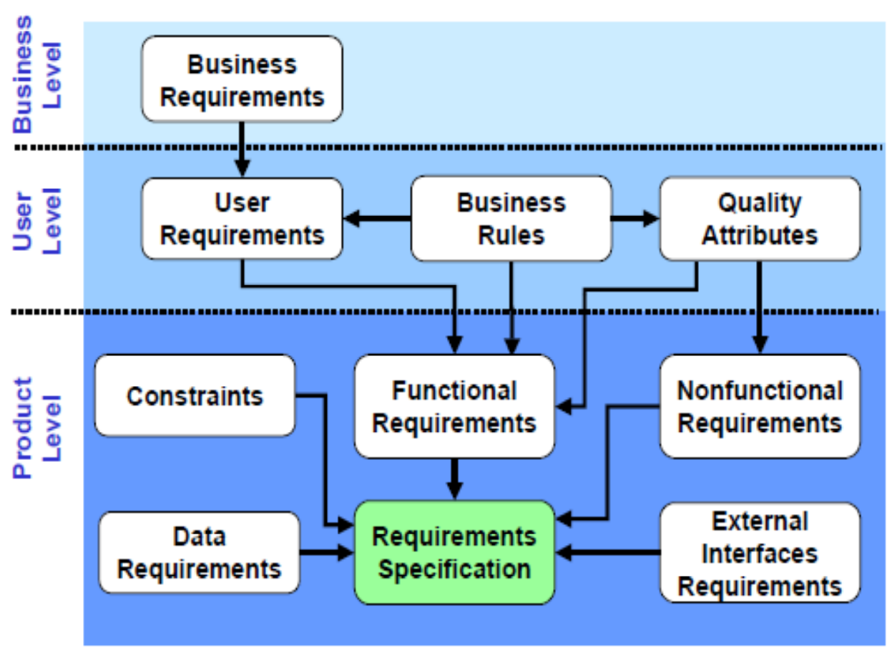
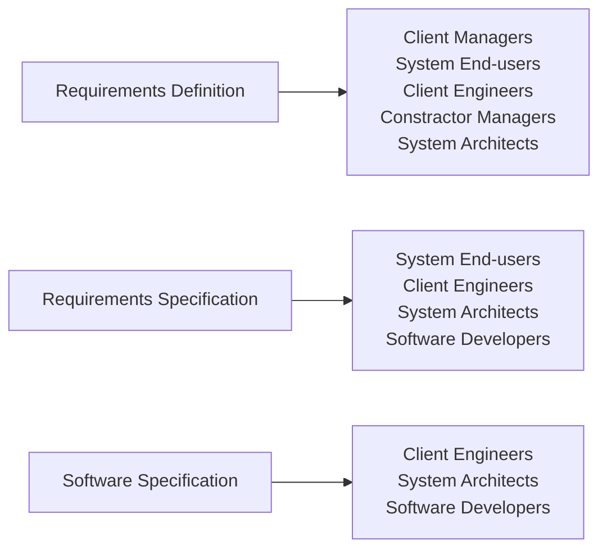

## Business Requirements

* Outline measurable goals for the business.
* Define the `why` behind a software project.
* Match project goals to stakeholder goals.
* Maintain a BRD with requirements, updates or changes.

## User Requirements

* Reflect specific user needs or expectations.
* Describe the `who` of a software project.
* Highlight how users interact with it.
* Create a URS, or make them part of the BRD.

## Software Requirements

* Identify features, functions, non-functional requirements and use cases.
* Delve into the `how` of a software project.
* Describe software as functional modules and non-functional attributes.
* Compose an SRS, and optionally, an FRS.

## Types of Readers

