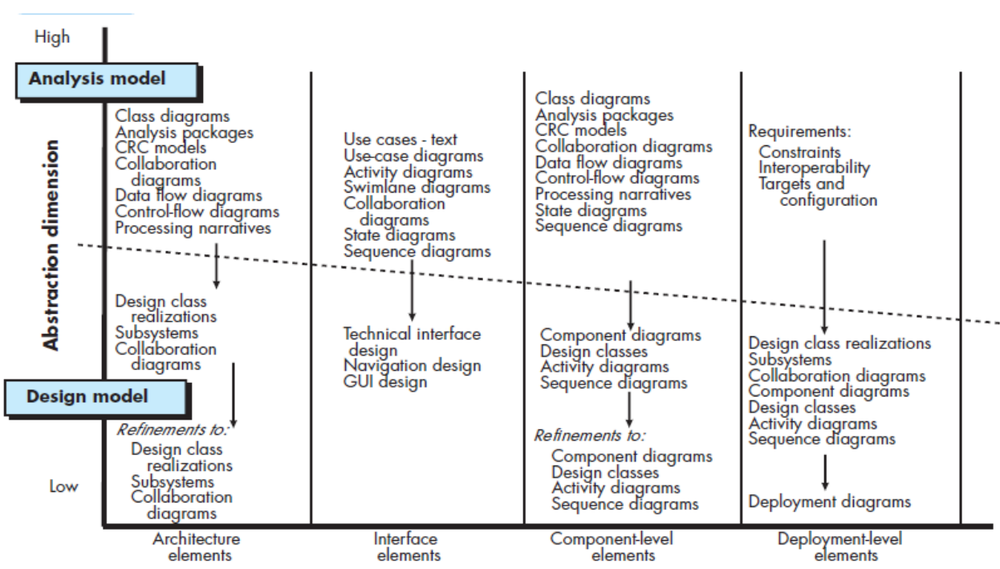
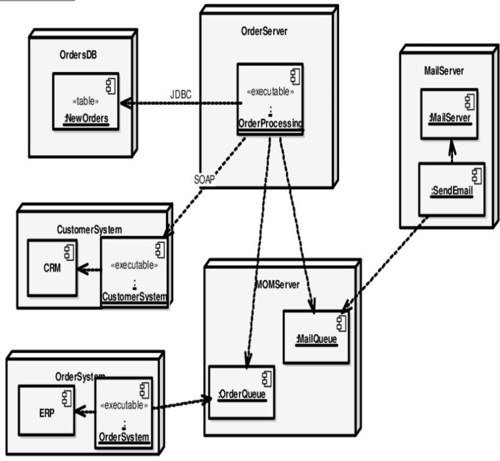
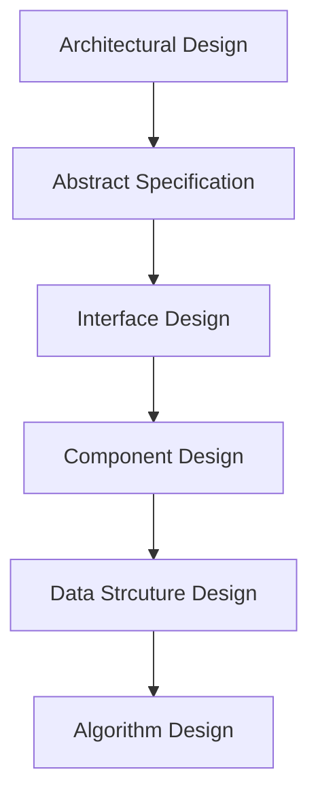

## Data Design Elements

* Create a model of data and/or information set that is represented at a high level of abstraction.
* It is refined into progressively more implementation specific representation that can be processed by the computer based system.
* The structure of data is an important part of software design.

## Architectural Design Elements

The architectural model is derived from three sources:

1. Information about the application domain for the software to be built.
2. Specific requirements model elements such as data flow diagrams or analysis classes, their relationships and collaboration for the problem at hand.
3. The availability of architectural styles and pattern.

## Interface Design Elements

* The interface design elements for software depict information flows into and out of the system and how it is communicated among the components defined as part of the architecture.
* There are three important elements of interface design:
  1. The **user interface (UI)**.
  2. **External interface (EI)** to other system, devices or other producers of consumers of information.
  3. **Internal interface (II)** various design components.

## Component-Level Design Elements

* It fully describes the internal details of each software component.
* It defines:
  * Data structures for all local data objects.
  * Algorithm details for all that occurs within a component.
  * An interface that allow access to all component operations (behaviors).

## Deployment-Level Design Elements

* It indicates how software functionality and subsystems will be within the physical computing that will support the software.
* The deployment diagram shows the computing environment but does not explicitly indicate configuration details.

## Software Design Process

