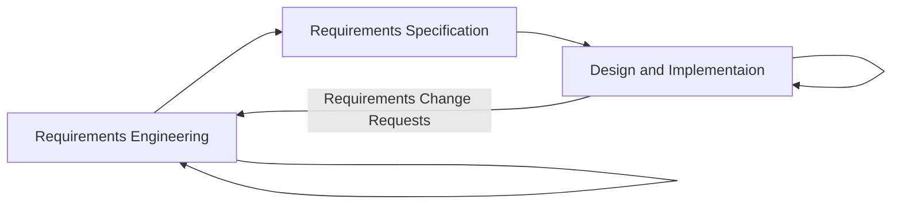

## Plan-based Development

* A plan-driven approach to software engineering is based around separate development stages with the outputs to be produced at each of these stages planned in advance.
* Not necessarily waterfall model. Incremental development is possible.
* Iteration occurs within activities.

## Agile Development

* Specification, design, implementation and testing are inter-leaved.
* The outputs from the development process are decided through a process of negotiation during the software development process.

### Agile Methods

* Focus on code rather than the design.
* Are based on an iterative approach to software development.
* Are intended to deliver working software quickly and evolve this quickly to meet changing requirements.
* To reduce overheads in the software process and to be able to respond to changing quickly.
* Without excessive rework.

### Principle of Agile Methods

| Principle            | Description                                                                                                                                                             |
| -------------------- | ----------------------------------------------------------------------------------------------------------------------------------------------------------------------- |
| Customer Involvement | Customers should be closely involved throughout the development process to provide and prioritize new system requirements and to evaluate the iterations of the system. |
| Incremental Delivery | The software is developed in increments with the customer specifying the requirements to be included in each increment.                                                 |
| People Not Process   | The skills of the development team should be recognized and exploited. Team members should be left to develop their own way of working without prescriptive processes.  |
| Enhance Change       | Except the system requirements to change and so design the system to accommodate these changes.                                                                         |
| Maintain Simplicity  | Focus on simplicity in both the software being developed and in the development process. Actively work to eliminate complexity from the system.                         |

### Agile Method Applicability

* Product development where a software company is developing a small or medium-size product for sale.
* Custom system development within an organization, where there is a clear commitment from the customer to become involved in the development process and where there are few external rules and regulations that affect the software.
