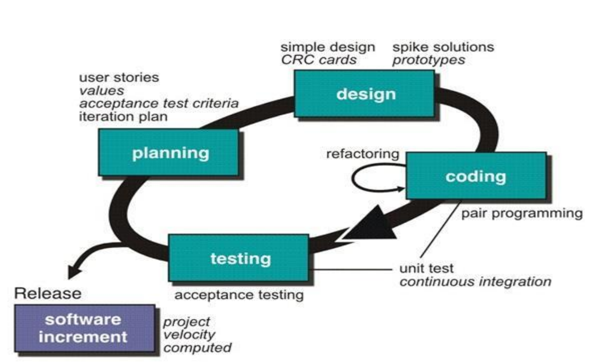

* The most widely used agile process. It uses object-oriented approach.

## XP Planning

* Begin with listening, leads to creation of "user stories" that describes required output, features, and functionality. Customer assign a value like priority to each story.
* Agile team assesses each story and assign the cost.
* Working together. Stories are grouped for a deliverable increment next release.
* A commitment (stories to be included, delivery date and other project matters) is made. Three ways:
  1. Either all stories will be implemented in a few weeks.
  2. High priority stories first.
  3. The riskiest stories will be implemented first.
* After the first increment "project velocity", namely number of stories implemented during the first release is used to help define subsequent delivery dates for other increments.
* Customers can add stories, delete existing stories, change value of an existing story, split stories as development work proceeds.

## XP Design

* Occur both before and after coding as refactoring is encouraged.
* Follow the `KIS` principle (Keep it simple). Nothing more nothing less than the story.
* Encourage the use of CRC (class-responsibility-collaborator) cards in an object-oriented context. The only design work product of XP. They identify and organize the classes that are relevant to the current software increment.
* For difficult design problem, suggests the creation of "spike solutions" -- a design prototype for that portion is implemented and evaluated.
* Encourage "refactoring" -- an iterative refinement of the internal program design. Does not alter the external behavior yet improve the internal structure. Minimize chances of bugs. More efficient, easy to read.

## XP Coding

* Recommend the construction of a unit test for a story before coding commences. So implementer can focus on what must be implemented to pass the test.
* Encourage "pair programming". Two people work together at one workstation. Real time problem-solving, real time review for quality assurance. Take slightly different roles.

## XP Testing

* All unit tests are executed daily and ideally should be automated. Regression test are conducted to test current and previous components.
* "Accept tests" are defined by the customer and executed to assess customer visible functionality.
