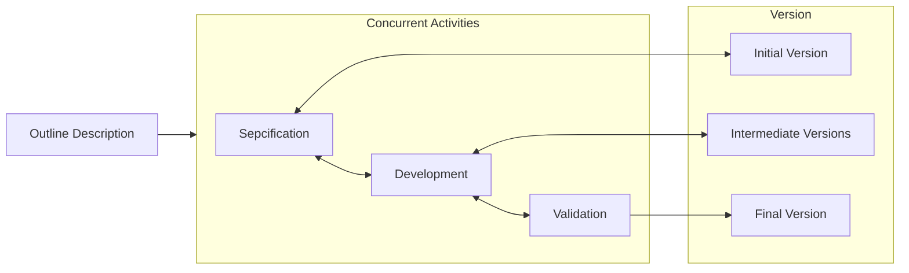

## Incremental Model

* Incremental development is based on the idea of developing an initial implementation, exposing this to user comment and evolving it through several versions until an adequate system has been developed.
* It is an agile process.

### Benefits of Incremental Process

1. Reduce the cost of accommodating changing customer requirements.
2. It is easier to get customer feedback.
3. More rapid delivery and deployment of useful software.

### Problems

* From a management perspective
  1. The process is not visible.
  2. System structure tends to degrade as new increments are added.

