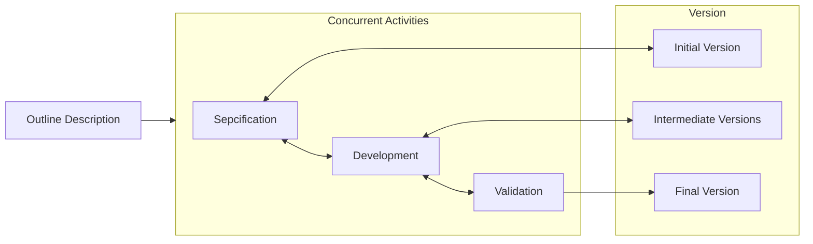

## Incremental Model

* Incremental development is based on the idea of developing an initial implementation, exposing this to user comment and evolving it through several versions until an adequate system has been developed.
* It is an agile process.

### Benefits of Incremental Process

1. Reduce the cost of accommodating changing customer requirements.
2. It is easier to get customer feedback.
3. More rapid delivery and deployment of useful software.

### Problems

* From a management perspective
  1. The process is not visible.
  2. System structure tends to degrade as new increments are added.

### Prototyping

* A prototyping is an initial version of a software system.
  * Demonstrate concepts.
  * Try out design options.
  * Find out more about the problem and possible solutions.
* Rapid, iterative development of the prototyping is essential so that costs are controlled, and system stakeholders can experiment with the prototype early in the software process.
* A software prototype can be used in a software development process to help anticipate changes that may be required:
  * **In the requirements engineering process,** a prototype can help with the elicitation and validation of system requirements.
  * **In the system design process,** a prototype can be used to explore particular software solutions and to support user interface design.
  * **A system prototype can be used while the system is being designed to carry out design experiments to check the feasibility of proposed design.**
  * **Prototyping is also an essential part of the user interface design process.**

#### Benefits of Prototyping

* Improve system usability.
* A closer match to users' real need.
* Improve design quality.
* Improve maintainability.
* Reduced development effort.

#### General Problems of Prototyping

* The prototype may not necessarily be used in the same way as the final system.
* The tester of prototype may not be typical of system users.
* The training time during prototype evaluation may be insufficient.
* If the prototype is slow, the evaluators may adjust their way of working and avoid those system features that have slow response times.
