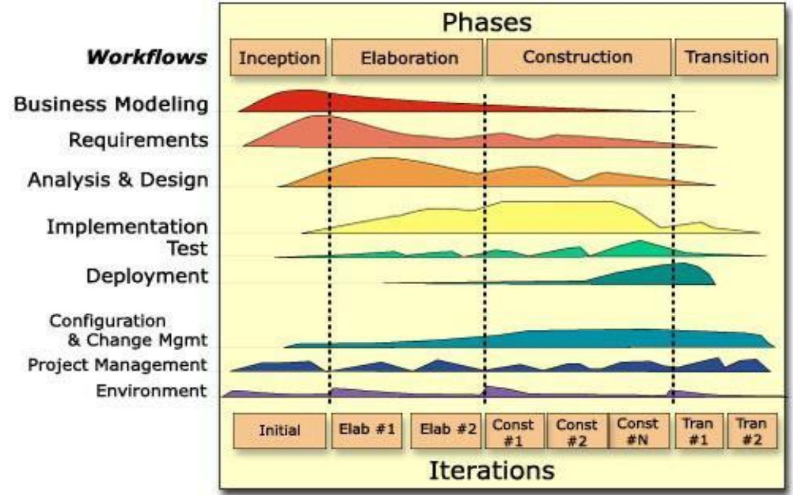

## Rational Unified Process

* It brings together elements from all the generic models and supports prototyping and incremental delivery.
* Rational Unified Process is normally described from 3 perspectives:
  1. A dynamic perspective shows the phases of the model over time.
  2. A static perspective shows the process activities that are enacted.
  3. A practice perspective suggests good practices to be used during the process.

### Workflow

* **Business Modelling:** The business process are modelled using business use cases.
* **Requirements:** Actors who interact with the system are identified and use cases are developed to model the system requirements.
* **Analysis and Design:** A design model is created and documented using architectural models, component models, object models, and sequence models.
* **Implementation:** The components in the system are implemented and structured into implementation sub-systems.
* **Testing:** It is an iterative process that is carried out in conjunction with implementation. System testing follows the completion of the complementation.
* **Deployment:** A product release is created, distributed to users and installed in their workplace.
* **Configuration and Change Management:** Support workflow managed changes to the system.
* **Project Management:** Support workflow manages the system development.
* **Environment:** This workflow is concerned with making appropriate software tools available to the software development team.
