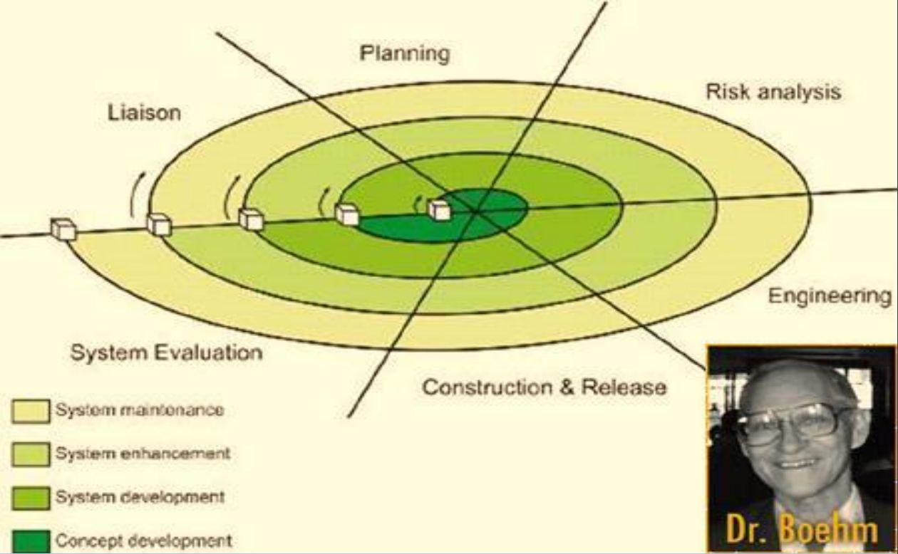

## Spiral Model

### Phases

* **Planning:**
  * Estimate the cost.
  * Schedule and resources for the iteration.
  * Understand the system requirements for continuous communication between the system analyst and the customer.
* **Risk Analysis:**
  * Identify potential risk.
  * Plan and finalize risk mitigation strategy.
* **Engineering:**
  * Testing, coding, deploying software at the customer site.
* **Evaluation:**
  * Evaluate the software by customer.
  * Identify and monitor risks such as schedule slippage and cost overrun.
