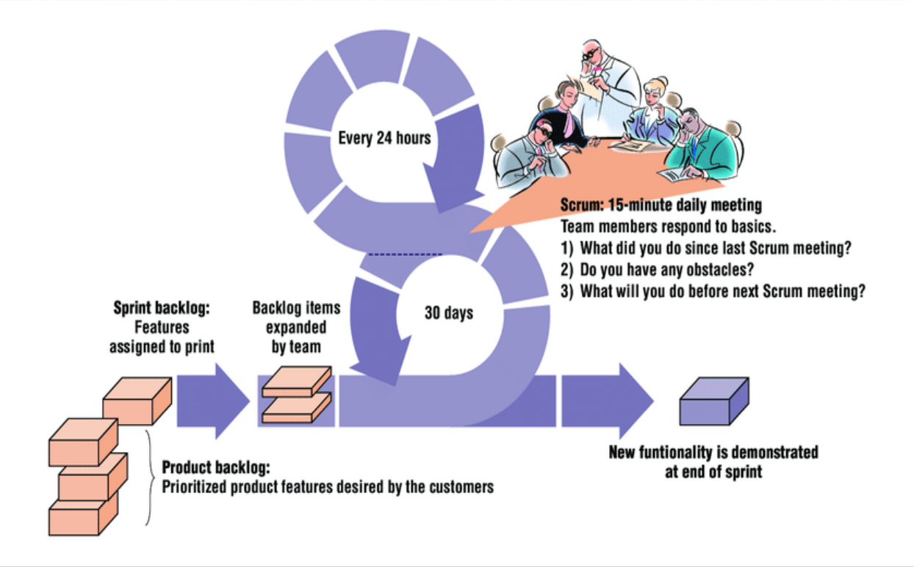

* Development work is partitioned into "packets".
* Testing and documentation are ongoing as the product is constructed.
* Work units occur in "sprints" and is derived from a "backlog" of existing changing prioritized requirements.
* Changes are not introduced in sprints (short term but stable) but in backlog.
* Meetings are very short (15 minutes daily) and sometimes conducted without chairs.
* `demos` are delivered to the customer with the time-box allocated. May not contain all functionalities. So customers can evaluate and give feedbacks.
