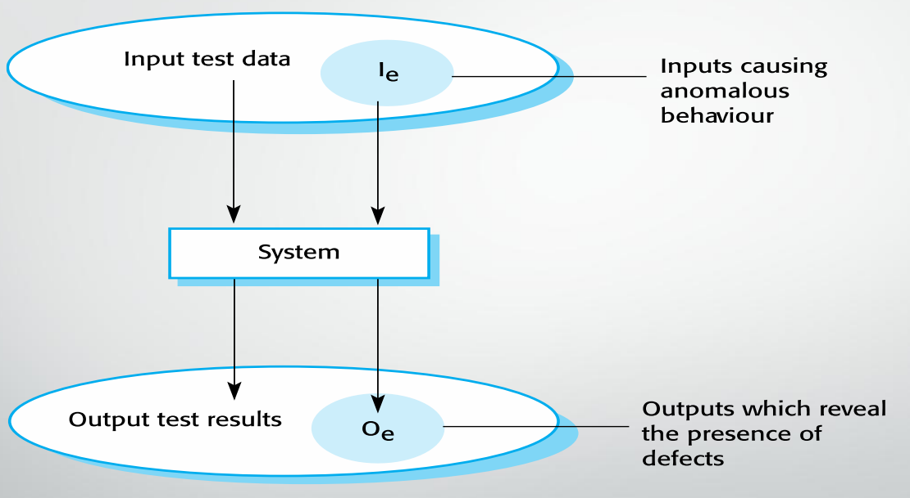
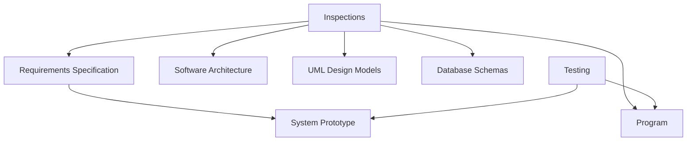

Testing is to show that a program does what it is intended to do, and to discover program defects before it is put into use.

Software is tested by using artificial data.

Testing is a part of a more general verification and validation process, which also includes static validation techniques.

## Goals of Testing

* To demonstrate to the developer and the customer that the software meets its requirements.
    1. Custom software: At least one test for every requirement in the requirements document.
    2. Generic software: There should be tests for all the system features.
* To discover situations in which the behavior of the software is incorrect, undesirable, or does not conform to its specification.

### Validation Testing

The first goal leads to validation testing.

It is to demonstrate to the developer and the customer that the software meets its requirements.

And a successful test shows that the system operates as intended.

### Defect Testing

It is to discover faults or defects in the software where its behavior is incorrect or not in conformance with its specification.

A successful test is a test that makes the system perform incorrectly, and so expose a defect in the system.

### Input-output Model of Program Testing

### Aims of Validation and Verification

1. Validation: To ensure that the software meets the customer's expectations, because the software should do what the user really requires.
2. Verification: To check that the software meets its stated functional and non-functional requirements. The software should conform to its specification.

## Required Confidence Level of Software Testing

It depends on 3 factors.

1. Software purpose:
    * The more critical the software is, the more important that it is reliable.
2. User expectations:
    * Many users have low expectations of software quality due to the experiences with buggy, unreliable software.
3. Marketing environment:
    * Competing products.
    * Price - If a software product is very cheap, users may be willing to tolerate a low level of reliability.
    * The required schedule for delivering the system.

## Software Inspections

The verification and validation process may involve software inspections and reviews.

Inspections and reviews analyze check the:

* System requirements
* Design models
* Program source code 
* Proposed system tests.

### Inspections and Testing

* Inspections and testing are complementary and not opposing verification techniques.
* Both should be used during the validation and verification process.
* Inspections can check conformance with a specification but not conformance with the customer's real requirements.
* Inspections can not check non-functional characteristics such as performance, usability, etc.

### Advantages of Inspections

* It is a static process, there is no need to be concerned with interactions between errors.
* Incomplete versions of a system can be inspected without additional costs. If a program is incomplete, developers need to develop specialized test harnesses to test the available parts.
* An inspection can also consider broader quality attributes of a program, such as compliance with standards, portability and maintainability.

