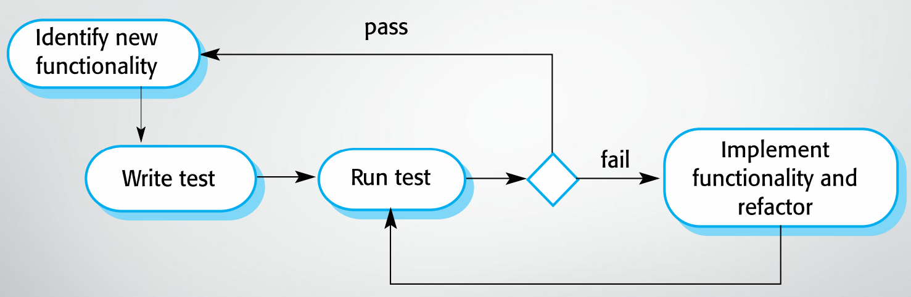

## Unit Testing

Unit testing tests individual programs units or object classes, which should focus on testing the functionality of objects or methods.

It is a process of testing program components, and individual functions or methods are the simplest type of component.

### Requirement of Unit Testing Design

When testing object classes, the design should be able to:

* Test all operations associated with the object.
* Set and check the value of all attributes associated with the object.
* Put the object into all possible states.

### Automated Unit Testing

Whenever possible, the unit testing should be automated.

In automated unit testing, developers make use of a test automation framework to write and run the program tests.

Unit testing frameworks provide generic test classes that allow developers to create specific test cases.

The automated unit testing can run all tests that developers have implemented and report on the success or failure of the tests.

#### Parts of Automated Unit Testing

An automated unit testing has three parts:

1. **Setup Part:** Initialize the system with the test cases, which is the inputs and outputs.
2. **Call Part:** Call the object or method to be tested.
3. **Assertion Part:** If the outputs of test match the expectations, then the assertion evaluates to true, which means the test has been successful. Otherwise, the assertion is false, meaning that the test has failed.

### Choose Unit Test Cases

Since testing is expensive and time-consuming, it is necessary to choose effective unit test cases. The effectiveness means:

1. The test cases should show that, when used as expected, the component does what it is supposed to do.
2. If there are defects in the component, these should be revealed by test cases.

## Component Testing

Several individual units are integrated to create **composite components**.

The component testing focus on testing component interfaces and showing that the component interface behaves according to its specification.

### Types of Interface

There are many types of interface between program components, and different types of interface error can occur.

1. Parameter interfaces.
2. Shared memory interfaces.
3. Procedural interfaces.
4. Message passing interfaces.

The interfaces above are in one component.

### Guidelines for Interface Testing

1. Examine the code to be tested and explicitly list each call to an external component.
2. Always test the interface with null pointer parameters.
3. Design test that deliberately cause the component to fail. Differing failure assumptions are one of the most common specification misunderstandings.
4. Design tests that generate much more messages than are likely to occur in practice. This is an effective way of revealing timing problems.
5. Design tests that vary the order in which these components are activated.

### System Testing

Some or all components are integrated to be a system to be tested as a whole.

The system testing focuses on testing component interactions.

System testing during development involves integration components to create a version of system and then testing the integrated system.

It checks that components are compatible, interact correctly and transfer the right data at the right time across their interfaces.

#### System Testing VS Component Testing

There are two important differences between system testing and component testing.

1. During system testing, reusable components that have been separately developed, and off-the-shelf systems may be integrated with newly developed components. Then the complete system is tested.
2. Components developed by different team members or groups may be integrated at this stage. System testing is a collective rather than an individual process.

#### Use-Case Testing

The use-cases developed to identify system interactions can be used as a basis for system testing.

Each use-case usually involves several system components, so testing the use-case forces these interactions to occur.

The sequence diagrams associated with the use-case documents the components and interactions that are being tested.

#### Test Cases Derived from Sequence Diagram

* An input of a request for a report should have an associated acknowledgement. A report should ultimately be returned from the request.
* You should create summarized data that can be used to check that the report is correctly organized.

## Test-driven Development (TDD)

* Test-driven development is an approach to program development in which you inter-leave testing and code development.
* Tests are written before code and passing the tests is the critical driver of development.
* Developers develop code incrementally, along with a test for that increment.
* TDD was introduced as part of agile methods such as Extreme Programming. However, it can also be used in plan-driven development processes.

### TDD Process Activities

1. Start by identifying the increment of functionality that is required.
2. Write a test for this functionality and implement this as an automated test.
3. Run the test, along with all other tests that have been implemented.
4. Implement the functionality and re-run the test.
5. Once all tests run successfully, moving on to implementing the next chunk of functionality.

### Benefits of Test-driven Development   

* Code coverage
    * Every code segment has at least one associated test.
* Regression testing
    * A regression test suite is developed incrementally as a program is developed.
* Simplified debugging
    * When a test fails, it is obvious where the problem is. Then the newly written code needs to be checked and modified.
* System documentation
    * The tests themselves are a form of documentation that describe what the code should be doing.

## Regression Testing

Regression testing is testing the system to check that changes have not broken previously working code.

In a manual testing process, regression testing is expensive but with automated testing, it is simple and straightforward. All tests are re-run after each change.

Tests must run successfully before the change is committed.

