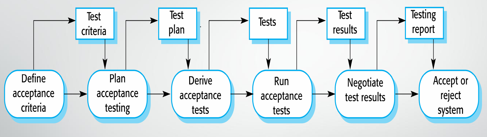

## Definition

* User or customer testing is a stage in the testing process in which users or customers provide input and advice on system testing.
* Users experiment with a new software product to see if they like it and that it does what they need.

## Importance of User Testing

User testing is essential. Because the influences from the user's working environment have a major effect on the reliability, performance, usability, and robustness of a system.

## Types of User Testing

1. **Alpha testing:** Users of the software work with the development team to test the software at the developer's site.
2. **Beta testing:** A release of the software is made available to users to allow them to experiment and to raise problems.
3. **Acceptance testing:** Customers test a system to decide whether it is ready to be accepted and deployed in the customer environment.

### Stages in Acceptance Testing

  

1. Define acceptance criteria
2. Plan acceptance testing
3. Derive acceptance tests
4. Run acceptance tests
5. Negotiate test results
6. Reject/accept system

